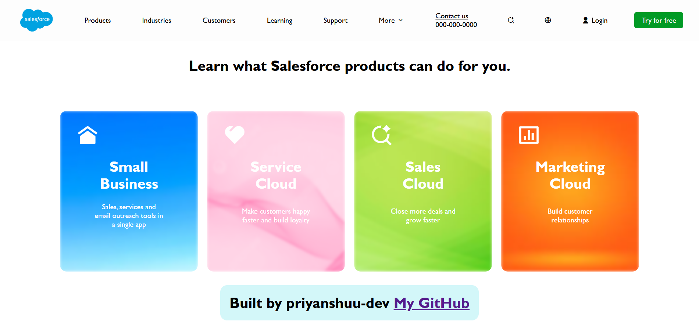

# Salesforce Clone

A responsive front-end clone of the Salesforce website built using HTML and CSS.

## 🚀 Live Demo

https://priyanshuu-dev.github.io/salesforce-clone/

## 📸 Screenshots

### 💻 Hero Section

### 🎨 Product Cards Section

## 📌 Features

* Responsive design (mobile and desktop)
* Fixed navigation bar
* Hero section with call-to-action buttons
* Card-based layout for products
* Clean and modern UI

## 🛠️ Tech Stack

* HTML5
* CSS3

## 📂 Project Structure

* index.html
* style.css
* images (screenshots and assets)

## 🎯 What I Learned

* Building responsive layouts using Flexbox and Grid
* Fixing mobile responsiveness issues
* Working with positioning and z-index
* Designing modern UI components

## 🔗 Author

GitHub: https://github.com/priyanshuu-dev
